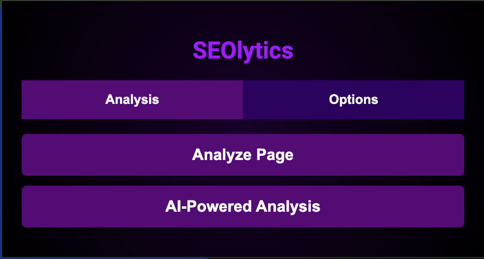

# Seolytics.ai Chrome Extension

## Overview

The **Seolytics.ai Chrome Extension** is a powerful tool for on-page SEO analysis. It helps website owners, SEO specialists, and digital marketers instantly analyze the SEO health of any website they visit, directly from the browser. With a clean and intuitive interface, this extension provides actionable insights to optimize your pages for better visibility and ranking in search engines.

## Features

- **Real-Time SEO Analysis:** Instantly checks the on-page SEO elements, including meta tags, header tags, images, internal/external links, and more.
- **SEO Score:** Provides a comprehensive SEO score for each page you analyze.
- **Actionable Insights:** Highlights key areas for improvement to boost your website’s SEO performance.
- **User-Friendly Interface:** Simple, clean, and easy to navigate for both beginners and advanced users.

## Installation

1. Download the extension from the Chrome Web Store (coming soon).
2. Or, manually install it:
   - Clone or download the repository.
   - Open Chrome and navigate to `chrome://extensions/`.
   - Enable **Developer mode** (top-right corner).
   - Click **Load unpacked** and select the folder containing your extension.

## How to Use

1. After installation, click on the **Seolytics.ai** extension icon in your Chrome toolbar.
2. Visit any website and click "Analyze."
3. View the SEO results, including scores, issues, and recommendations.

## Screenshots

## Contributing

If you want to contribute to this extension, please fork the repository, make your changes, and submit a pull request.

## Contact

For questions or support, reach out to us at [support@seolytics.ai](mailto:support@seolytics.ai).
